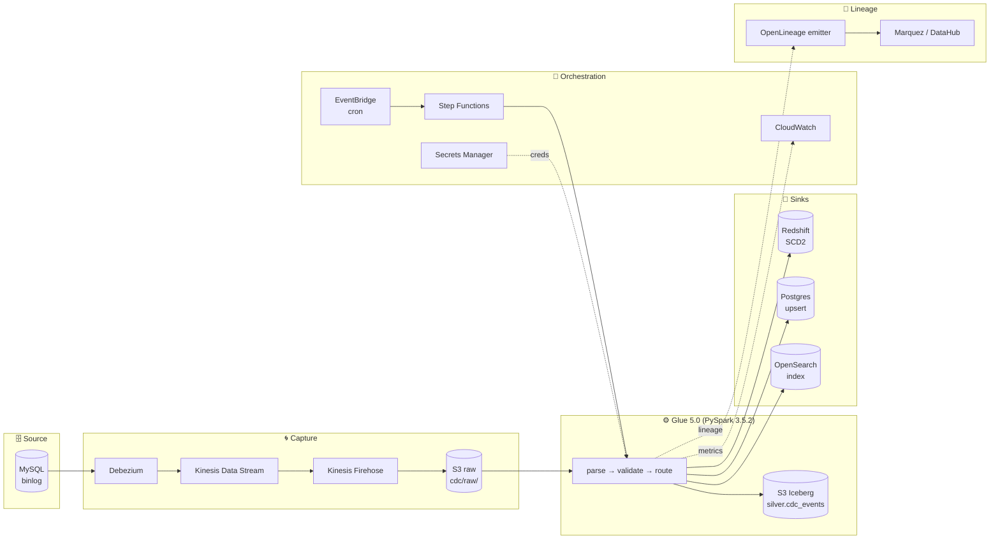
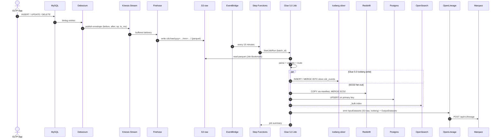

# Architecture

## Overview

This project implements a production-grade **Change Data Capture (CDC)** pipeline on AWS. Debezium captures binlog changes from MySQL, Kinesis transports them, S3 durably stores raw events, **AWS Glue 5.0** (PySpark) processes them with native **Apache Iceberg** sink, and multiple sinks receive the output in parallel. **OpenLineage** events stream into Marquez / DataHub for end-to-end lineage.

## Design Decisions

### End-to-end CDC sequence (one Glue batch)

### Why Debezium (binlog CDC) instead of JDBC polling?

- **Captures DELETEs**: JDBC `SELECT *` cannot see deleted rows — they simply disappear from the result set. Downstream tables become stale.
- **Zero source impact**: Reading binlog is a sequential I/O pattern. JDBC polling of a 10M-row table hammers the primary key index.
- **Strict event ordering**: Binlog is a totally-ordered log. We preserve that ordering through Kinesis shards (partitioned by table).
- **Low latency**: End-to-end (change committed to MySQL → visible in Redshift) is typically under 5 minutes.

### Why Kinesis + Firehose + S3 (not direct Kafka Connect S3 sink)?

- **Decouples ingestion from processing**: Glue jobs run in 15-minute batches. Kinesis buffers continuously. If Glue fails, no data is lost.
- **Replay**: S3 holds 90 days of raw events. Any downstream bug can be fixed and replayed without touching the source DB.
- **Cost**: Firehose + S3 is significantly cheaper than running a 24/7 Kafka Connect S3 sink at our volume.

### Why AWS Glue instead of EMR or self-managed Spark?

- **Zero infrastructure management**: No EMR cluster to size, patch, or right-scale.
- **Native integration with Glue Catalog**: DDL evolution handled automatically.
- **Pay-per-DPU-second**: Idle cost is zero. Batch jobs that run 10 min/hour pay for 10 min/hour.
- **Production-proven**: This pattern mirrors how enterprise platforms deploy Glue for CDC at scale.

### Why multi-sink fanout?

Different consumers have different query patterns:
- **Redshift** is columnar and excellent for BI aggregations. Poor for row lookups.
- **Postgres** is a row store with sub-ms reads. Great for microservice queries, poor for analytics scans.
- **OpenSearch** has an inverted index. Great for full-text search, poor for joins.

One CDC pipeline feeding three specialized stores gives every consumer the right latency/shape trade-off without dual writes from the application.

### Exactly-once semantics

Two-layer approach:
1. **Batch idempotency**: Every Glue job run records its `batch_id` in DynamoDB before writing. Re-runs with the same batch_id are no-ops.
2. **Row-level idempotency**: MERGE-on-primary-key. Re-applying the same event produces the same result.

The combination means replay is always safe.

### SCD2 for dimensions

Customer records change over time (tier upgrades, name changes). Facts reference those attributes at the time they occurred — SCD2 preserves the historical version.

Implementation: hash-based change detection. We compute `MD5(concat_ws('||', attr1, attr2, ...))` and close the old row + insert the new row when the hash differs. Deterministic, reusable across dimensions.

### Schema evolution

- **Additive changes** (new column): propagate automatically via Glue's dynamic frame.
- **Breaking changes** (column type change): quarantined to a separate S3 prefix; human review required.
- **Renames**: treated as drop + add by Debezium; requires explicit mapping rule in `src/schemas/contracts.py`.

## Trade-offs

| Decision | Trade-off |
|---|---|
| 15-min Glue batching | Latency vs cost — continuous Glue would be lower latency but ~5x cost |
| Kinesis on-demand | Higher per-GB cost vs provisioned — but no shard management |
| Postgres via `execute_values` | Simpler than S3 COPY extension — but ~5x slower on large batches |
| OpenSearch single AZ in dev | Cost — production uses 3-AZ multi-node |
| Synchronous SFN fanout | Easier to reason about — parallel fanout would be faster but harder to debug |

## Operational Concerns

- **Idempotency**: DynamoDB-backed batch tracker prevents duplicate writes on retry.
- **Observability**: JSON logs in CloudWatch, custom metrics for row counts and lag.
- **Alerting**: SNS topic → email (and optionally PagerDuty via webhook).
- **Cost control**: Glue auto-terminates; Kinesis on-demand; Redshift can be paused overnight; S3 lifecycle expires old raw events after 90 days.
- **DR**: S3 raw events are the source of truth; any target can be rebuilt by replaying.

## Reference

- [Debezium MySQL Connector](https://debezium.io/documentation/reference/stable/connectors/mysql.html)
- [AWS Glue Job Bookmarks](https://docs.aws.amazon.com/glue/latest/dg/monitor-continuations.html)
- [Redshift COPY best practices](https://docs.aws.amazon.com/redshift/latest/dg/c_best-practices-use-copy.html)
- [Kinesis Firehose dynamic partitioning](https://docs.aws.amazon.com/firehose/latest/dev/dynamic-partitioning.html)
